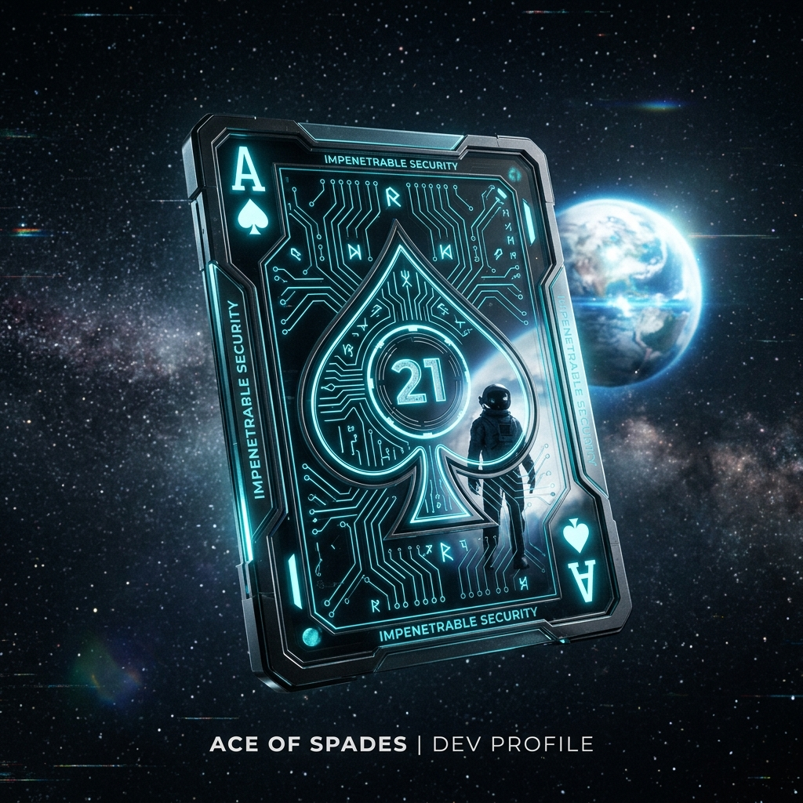

  

  

  <b>Full Stack AI Developer | AI & ML Engineer | 21rd Century Architect</b>

---

### ♠️ THE HAND OF INNOVATION
*Dealing the most impactful projects in the space.*

  
  
  

---

### 🌌 21 BITS OF NAIMISH
*A window into the system at 00:30.*

1. **The Ace Alias**: Why `ace-ify`? Pushing for top-tier engineering in every line of code.
2. **00:30 Routine**: My prime uptime. When the world sleeps, the agents wake up.
3. **Founder of Future**: Leading a tech initiative to bridge the gap between present and future.
4. **Guardial**: My sentinel for AI security—detecting jailbreaks before they happen.
5. **Farm2Market**: Engineering AgriTech to simplify the journey from farm to plate.
6. **Swadhikaar**: Building social impact through AI-driven welfare assistance.
7. **Resumind**: Turning resume parsing into high-fidelity intelligence.
8. **Hackathon Veteran**: Multiple wins fueled by adrenaline and "vibe-coding" turned precise.
9. **B.Tech Scholar**: Deep-diving into CS (AI & ML) @ AKTU (2024-2028).
10. **Python Native**: Speaking the language of data and automation fluently.
11. **Full Stack Architect**: From FastAPI backends to sleek Next.js interfaces.
12. **Agentic AI Focus**: Crafting autonomous systems that don't just answer—they act.
13. **Cloud Native**: Deployed on Google Cloud, Supabase, and orchestration through Docker.
14. **DevOps Mindset**: Automating the boring stuff to focus on the impossible stuff.
15. **Lucknow Based**: Blending the culture of Nawabs with the speed of Silicon Valley.
16. **Builder Mentality**: Fast. Adaptive. Impenetrable.
17. **Love for 21**: My lucky number, my ritual, my brand.
18. **Caffeinated Logic**: Solving complex bugs over a cup of deep, dark coffee.
19. **Night Owl Philosophy**: The best solutions are often found in the silence of the night.
20. **Continuous Learner**: Currently exploring the depths of RAG, LLM security, and Multi-Agent Systems.
21. **The Vision**: Scaling "Project 21" into a global standard for intelligent systems.

---

### 🛠️ ARSENAL

  

---

### 📊 SYSTEM STATUS

  
  

---

### 📡 CONNECT WITH THE SYSTEM

  
  
  

  <i>"Fast. Adaptive. Impenetrable."</i> 
  <b>© 2026 Naimish Singh</b>

